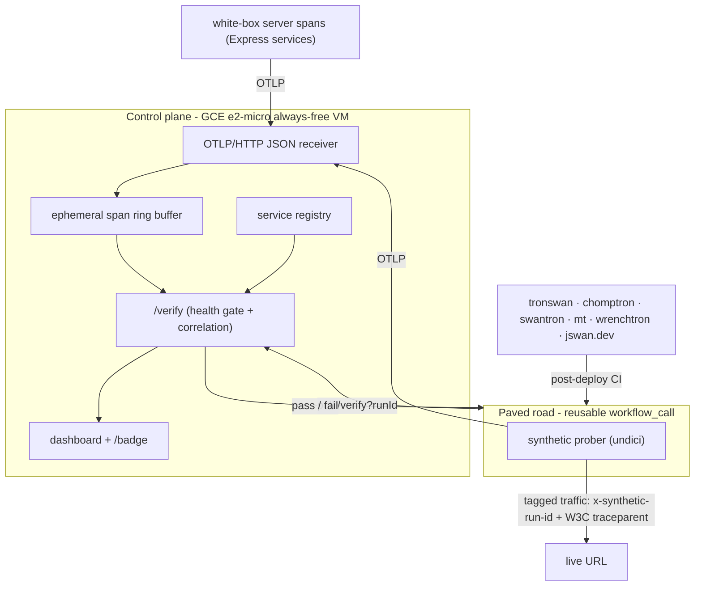

# watchtron

**A fleet observability paved road.** On every deploy, watchtron drives synthetic
golden-signal traffic at the live service and proves — via OpenTelemetry — that
the deploy is actually serving real requests within its deploy health gate. If
the telemetry never lands, the deploy fails.

It is a single reusable GitHub Actions workflow + one shared instrumentation
package + one tiny control plane that onboards any service in minutes, across a
deliberately heterogeneous fleet.



## Why it's interesting

The fleet spans **five hosting models** — DigitalOcean App Platform, GCP Cloud
Run, GitHub Pages, Firebase Hosting, and a self-hosted AT Protocol PDS. watchtron
verifies all of them from one paved road:

- **Black-box probing is universal** — works for the static sites and the
  unmodifiable upstream PDS.
- **White-box server spans enrich** the two services we own the runtime for
  (tronswan, chomptron) via a drop-in package.
- **W3C trace-context propagation** correlates the prober's client span with the
  origin's server span, so a pass means traffic truly reached the instrumented
  origin — not just an edge cache.

## Layout

| Path                                                           | What                                                            |
| -------------------------------------------------------------- | --------------------------------------------------------------- |
| [`registry/services.yaml`](registry/services.yaml)             | Declarative fleet: URLs, critical routes, health gates, white-box flags |
| [`packages/registry`](packages/registry)                       | Loader + validator for the registry                             |
| [`control-plane`](control-plane)                               | OTLP receiver, ephemeral buffer, `/verify`, `/badge`, dashboard |
| [`prober`](prober)                                             | Synthetic traffic generator + health-gate scoring + OTLP export |
| [`packages/otel-bootstrap`](packages/otel-bootstrap)           | Dual CJS+ESM white-box OpenTelemetry bootstrap                  |
| [`.github/workflows/verify.yml`](.github/workflows/verify.yml) | The reusable `workflow_call` the fleet invokes                  |

## Quickstart (local, no backend account)

```bash
npm install --workspaces --include-workspace-root

# 1. start the control plane (token off in dev)
npm run control-plane:start        # http://localhost:4318  (dashboard at /)

# 2. probe a live service and verify telemetry landed
npm run probe -- --service mt --verify
```

Open <http://localhost:4318> for the fleet dashboard.

## Onboarding a service (the paved road)

1. Add an entry to [`registry/services.yaml`](registry/services.yaml).
2. Call the reusable workflow after your deploy job:

   ```yaml
   verify:
     needs: deploy
     uses: swantron/watchtron/.github/workflows/verify.yml@main
     with:
       service: my-service
     secrets:
       otlp_endpoint: ${{ secrets.WATCHTRON_OTLP_ENDPOINT }}
       token: ${{ secrets.WATCHTRON_TOKEN }}
   ```

3. _(White-box, optional)_ instrument the origin — see
   [`packages/otel-bootstrap`](packages/otel-bootstrap/README.md).
4. Add a status badge to the repo's README:

   ```md
   
   ```

## Deploy health gate

A deploy passes only when, for that run id:

- availability ≥ `healthGate.availabilityPct`
- p95 latency ≤ `healthGate.p95LatencyMs`
- every `criticalRoutes` entry was probed
- (white-box) a server span correlated with the prober's trace

These are scored over a small synthetic burst (`requests` × `criticalRoutes`)
fired immediately after deploy — a post-deploy **health gate**, not a windowed
production SLO. If the control plane itself is unreachable, the deploy is **not**
blocked (it's a watchtron outage, not a service failure); pass `strict: true` to
the verify workflow to block on outage instead.

Deployed on a GCE `e2-micro` always-free VM — see
[`control-plane/deploy`](control-plane/deploy/README.md).

## Operating watchtron

For the full picture — every repo it touches, the GCP infrastructure, all CI/CD
flows, the secrets matrix, the one-time bootstrap, day-2 operations, and a
troubleshooting catalog — see **[`docs/SYSTEM.md`](docs/SYSTEM.md)**.
